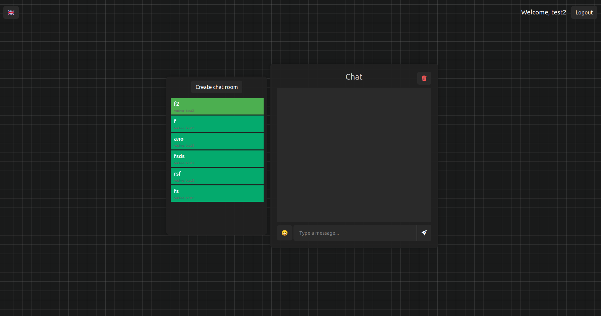
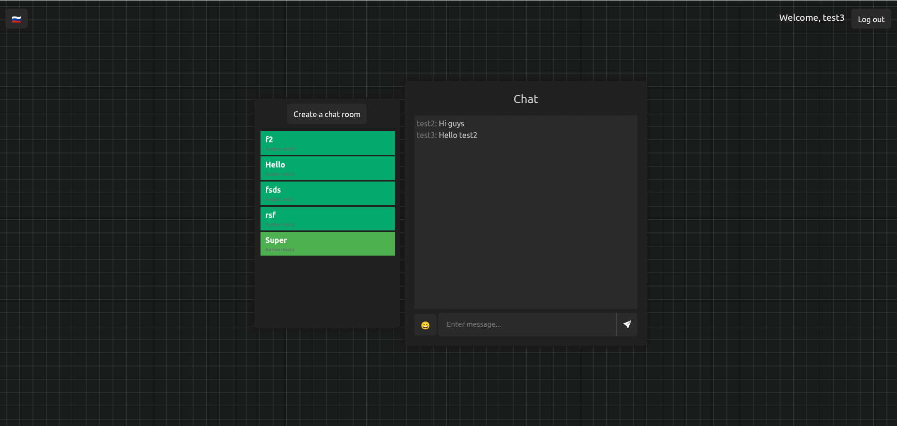
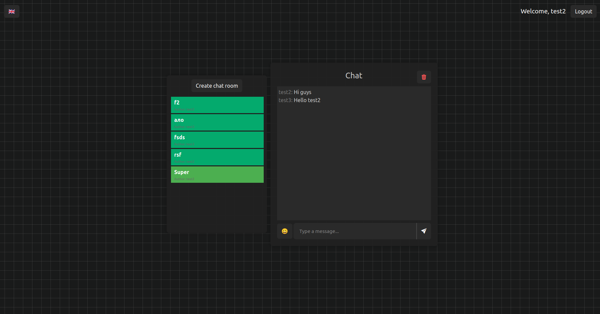

Simple real-time chat app made with Django, Daphne, Redis, Vue and Vite. It allows to create and delete multiple chats.

test2 user login page

test3 user login page

test2 user recieved message from test3 user

